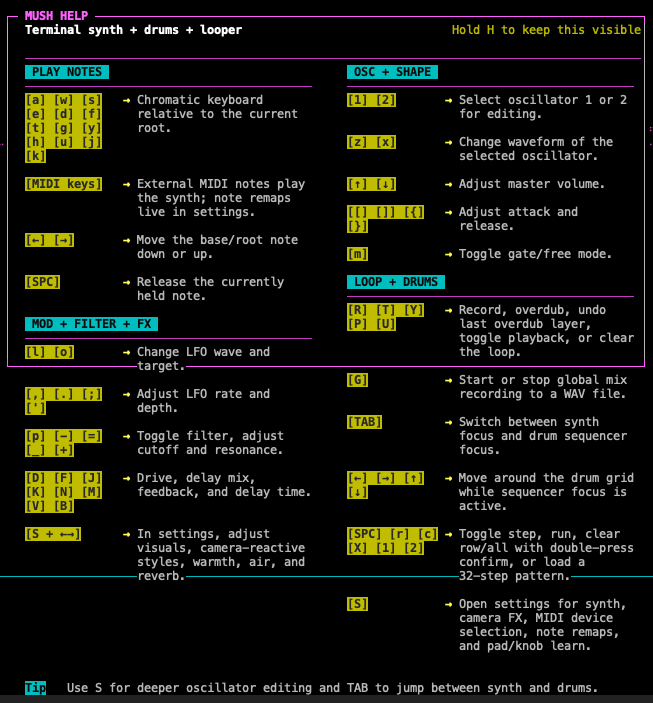

# mush

```text
███╗   ███╗██╗   ██╗   ███████╗██╗  ██╗
████╗ ████║██║   ██║   ██╔════╝██║  ██║
██╔████╔██║██║   ██║   ███████╗███████║
██║╚██╔╝██║██║   ██║   ╚════██║██╔══██║
██║ ╚═╝ ██║╚██████╔╝██╗███████║██║  ██║
╚═╝     ╚═╝ ╚═════╝ ╚═╝╚══════╝╚═╝  ╚═╝
```

`mush` is a terminal synthesizer, drum machine, looper, and MIDI playground for the command line.

It combines playable synth voices, a step sequencer, live effects, recording tools, and terminal visuals in a fast keyboard-driven interface.

## Quick Start

```bash
git clone git@github.com:sedoy26/mush.git && cd mush && chmod +x mu.sh && ./mu.sh
```

Rust runtime:

```bash
cargo run --manifest-path rust/Cargo.toml -p mush-cli
```

### Install (binary, no Rust)

For tagged versions (e.g. **v0.0.1**), pre-built **`mush-cli`** binaries are attached on **[GitHub Releases](https://github.com/sedoy26/mush/releases)** (Linux x86_64, Windows x86_64, macOS Apple Silicon and Intel). A tag can be pushed from a feature branch before it merges; see `rust/RELEASING.md`.

1. Download the asset that matches your OS.
2. **macOS / Linux:** `chmod +x mush-cli-*` then run `./mush-cli-…` from a terminal.
3. **Windows:** run `mush-cli-windows-x86_64.exe` from PowerShell or cmd.
4. Run `mush-cli` from anywhere; it auto-uses the binary's folder for `projects/` and `wav/` (created on first run). To share data with the shell script version, run it from the repository root.

You still need a working audio device. **Camera** visual mode additionally expects **`ffmpeg`** on your `PATH` (optional for everything else).

The Rust runtime now mirrors the main `mush` feature set and stores data in top-level `projects/` and `wav/` next to the executable (or next to `mu.sh` when run from the repo).

## Status

- primary support target: macOS terminal environments
- likely portable to Linux with working PortAudio and terminal support
- Windows binaries are built in CI; behavior is less tested than macOS
- audio input selection is stored for future use, but live input is not yet processed by the synth engine

## Requirements

- `python3`
- a working terminal with `curses` support
- PortAudio-compatible audio output for `sounddevice`
- `ffmpeg` if you want to use camera visuals
- optional MIDI dependencies handled by the bootstrap script

## Features

- dual-oscillator synth with waveform, level, octave, and detune control
- realtime audio output with delay, warmth, air, reverb, filter, and limiting
- 6-voice, 32-step drum sequencer with multiple drum sound banks
- audio looper with record, overdub, undo, play, and clear
- global stereo WAV recording
- oscilloscope and camera-based visual modes
- MIDI device input, note remapping, and learnable pad/knob bindings
- audio output selection and stored audio input preference for future use
- project save/load for synth, drum, UI, audio, and MIDI settings

## Files and folders

- `mu.sh` — launcher and embedded app source of truth
- `rust/` — structured Rust port with modular runtime and terminal frontend
- `wav/` — saved mix recordings such as `mush.wav`
- `projects/` — saved project files using the `.mush` extension
- `README.md` — project overview and usage notes

Generated files in `wav/` and `projects/` are gitignored by default, except for `wav/demo.wav` and `projects/demo.mush`.

## Running

```bash
./mu.sh
```

On first launch, the script creates:

- `$HOME/.mush-venv` for Python dependencies
- `$HOME/.mush.py` for the generated runtime script

The app expects a working terminal and an available audio output device. Camera mode also expects `ffmpeg` with camera capture support.

## First launch

On a first run after cloning:

- start with `./mu.sh`
- press `H` to toggle the help overlay
- press `TAB` to switch between synth and drum focus
- press `S` to open settings
- load `projects/demo.mush` from the `PROJECT` settings tab if you want a ready-made example

If you load the demo project on another machine, `mush` uses that machine's current default OS audio output by default.

## Main controls



- `TAB` — switch between synth focus and drum focus
- `S` — open settings
- `H` — show help
- `q` — quit

### Synth

- `a w s e d f t g y h u j k` — play notes
- `SPACE` — release held note
- `1` / `2` — select oscillator
- `z` / `x` — change selected oscillator waveform
- `↑` / `↓` — master volume
- `←` / `→` — root note
- `[` / `]` — attack
- `{` / `}` — release
- `m` — gate/free mode
- `p` — filter on/off
- `-` / `=` — cutoff
- `_` / `+` — resonance
- `l` — LFO wave
- `o` — LFO target
- `,` / `.` — LFO rate
- `;` / `'` — LFO depth
- `D` / `F` — drive
- `J` / `K` — delay mix
- `N` / `M` — delay feedback
- `V` / `B` — delay time

### Loop and recording

- `R` — record loop (replace)
- `T` — overdub loop
- `Y` — undo last overdub layer
- `P` — toggle loop playback
- `U` — clear loop
- `G` — start/stop global WAV recording

### Drums

- `TAB` into drum focus first
- `←` / `→` / `↑` / `↓` — move sequencer cursor
- `SPACE` — toggle current step
- `r` — start/stop sequencer
- `c` — clear current row with confirmation
- `X` — clear all rows with confirmation
- `1` / `2` — load built-in patterns
- `,` / `.` / `<` / `>` — BPM adjustments
- `-` / `=` — selected drum voice level

## Settings pages

The settings UI currently includes:

- `MAIN` — synth, visuals, drum bank, oscillator, and FX settings
- `CAM FX` — camera visual style and reactivity
- `PROJECT` — save/load `.mush` project files
- `SOUND DEVICE` — audio output selection and stored input preference
- `MIDI DEVICE` — MIDI input selection and routing
- `MIDI NOTE` — note remapping
- `MIDI MAP` — learnable pad/knob bindings

## Project saves

Project files store the current working setup, including:

- synth parameters and oscillator settings
- drum pattern, BPM, bank, and per-voice levels
- UI visual settings
- selected audio input/output names or the portable OS-default audio tokens
- MIDI device settings, remaps, and bindings

They do not currently store recorded loop audio.

## Repository layout

- `mu.sh` contains the launcher and the embedded Python application
- `wav/` holds exported mix recordings; only `wav/demo.wav` is tracked
- `projects/` holds saved `.mush` projects; only `projects/demo.mush` is tracked
- community and repository health files live in `.github/`, `CONTRIBUTING.md`, `SECURITY.md`, and `LICENSE`

## Known limitations

- the looper is intentionally simple and not tempo-quantized
- current playback is effectively one note lane with layered oscillators, not a full multitimbral performance engine
- audio device hot-swapping is basic and intended for local use rather than pro-audio routing edge cases
- camera mode depends on local `ffmpeg` support and device permissions
- the app is still maintained as an embedded-Python single-file launcher for convenience

## Contributing

Contributions are welcome. Please read `CONTRIBUTING.md` before opening a pull request.

For security-sensitive issues, use `SECURITY.md` rather than filing a public issue.

## License

This project is released under the MIT License. See `LICENSE`.

## Validation

When editing `mu.sh`, useful checks are:

```bash
bash -n mu.sh
python3 - <<'PY'
from pathlib import Path
text = Path('mu.sh').read_text()
start = text.index("<< 'PYEOF'\n") + len("<< 'PYEOF'\n")
end = text.index("\nPYEOF", start)
compile(text[start:end], 'embedded_app.py', 'exec')
print('ok')
PY
```

## Notes

- audio input selection is saved for future expansion, but the current app does not process live input yet
- the looper is free-running and not tempo-quantized
- the whole app currently lives inside the `mu.sh` heredoc for convenience
